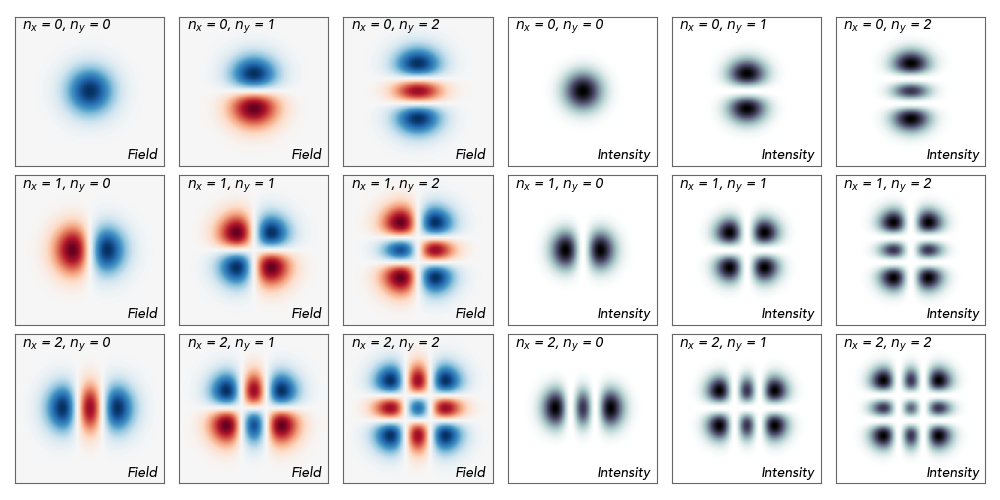

Hermite-Gaussian Laser Pulse
============================

Used to define a Hermite-Gaussian transverse laser profile. 
Hermite-Gaussian modes are a family of solutions to the paraxial
wave equation written in cartesian coordinates. The modes are
characterised by two transverse indices :math:`n_x` and :math:`n_y`. 

.. math::
    E_u(x,y) = Re\left[ E_0\,
    H_{n_x}\left ( \frac{\sqrt{2} x}{w_0}\right )\,
    H_{n_y}\left ( \frac{\sqrt{2} y}{w_0}\right )\,
    \exp\left( -\frac{x^2 + y^2}{w_0^2} \right) 
    \, p_u \right]

where :math:`u` is either :math:`x` or :math:`y`, :math:`H_{n}` is the
Hermite polynomial of order :math:`n`, :math:`p_u` is the polarization
vector, :math:`Re` represent the real part, and :math:`x` and :math:`y`
are the transverse coordinates (orthogonal
to the propagation direction). The other parameters in this formula
are defined below.