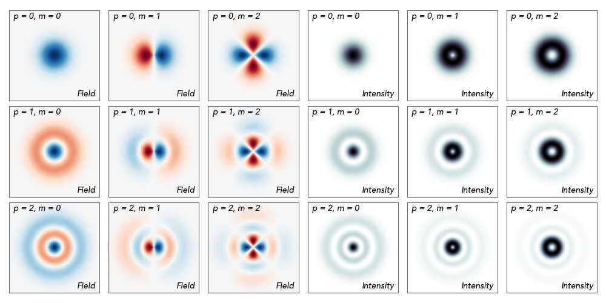

Laguerre-Gaussian Laser
==============================

Used to define a Laguerre-Gaussian transverse laser profile. 
Laguerre-Gaussian modes are a family of solutions to the paraxial
wave equation written in cylindrical coordinates. The modes are
characterised by a radial index :math:`p` and an azimuthal index
:math:`m`. 

The modes can have azimuthally varying fields (for :math:`m > 0`)
but any single mode will always have an azimuthally invariant 
intensity profile.

Defines a Laguerre-Gaussian laser pulse.
More precisely, the electric field corresponds to:

.. math::
    E_u(r,\theta,t) = Re\left[ E_0\, r^{|m|}e^{-im\theta} \,
    L_p^{|m|}\left( \frac{2 r^2 }{w_0^2}\right )\,
    \exp\left( -\frac{r^2}{w_0^2} \right) \times p_u \right]

where :math:`u` is either :math:`x = r \cos{\theta}` or 
:math:`y = r \sin{\theta}`, :math:`L_p^{|m|}` is the
Generalised Laguerre polynomial of radial order :math:`p` and
azimuthal order :math:`|m|`, :math:`p_u` is the polarization
vector, :math:`Re` represent the real part, and :math:`r` is the radial
coordinate (orthogonal to the propagation direction) and :math:`\theta`
is the azmiuthal coordinate. The other parameters
in this formula are defined below.